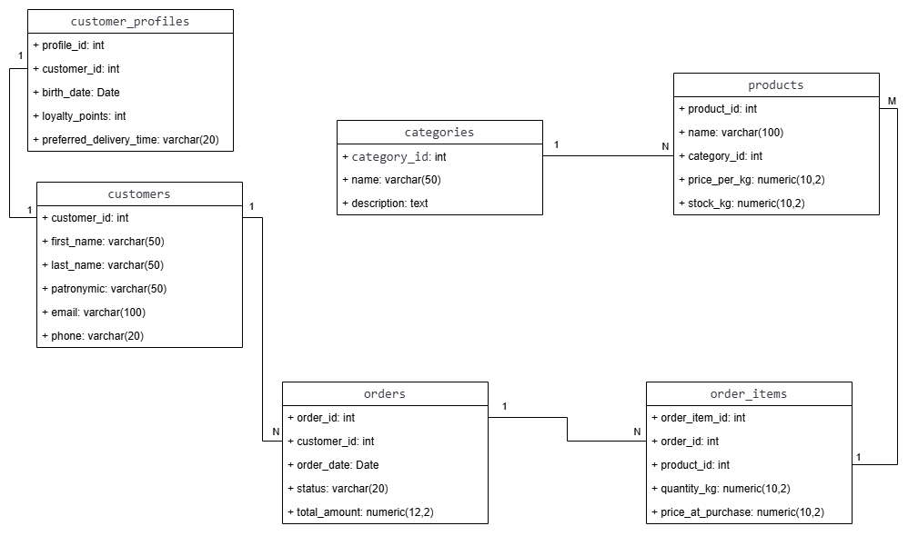

## Отчёт по лабораторной работе №1 по предмету «Корпоративные базы данных»

### Выполнил: Стукалкин Егор Олегович

#### Создание БД и таблиц
В ходе работы была разработана база данных для интернет-магазина мяса «FreshMeat». Система предназначена для учёта товаров, управления заказами и ведения клиентской базы.
В модели выделено 6 сущностей:
- customers и customer_profiles — информация о покупателях и их профилях лояльности (связь 1:1);
- categories и products — каталог товаров, сгруппированных по категориям мяса (связь 1:N);
- orders — заказы клиентов (связь 1:N с покупателями);
- order_items — состав заказов, реализующий связь многие ко многим между заказами и товарами.

ER-модель нормализована до третьей нормальной формы (3НФ), что обеспечивает отсутствие избыточности данных и целостность информации.

<p align="center"></p>

Далее был выполнен скрипт по созданию таблиц в базе данных. Пример sql скрипта одной таблице представлен ниже.
```sql
CREATE TABLE order_items (
    order_item_id INT GENERATED ALWAYS AS IDENTITY PRIMARY KEY,
    order_id INT NOT NULL REFERENCES orders(order_id) ON DELETE CASCADE,
    product_id INT NOT NULL REFERENCES products(product_id),
    quantity_kg NUMERIC(10,2) CHECK (quantity_kg > 0),
    price_at_purchase NUMERIC(10,2) NOT NULL
);
```
Скрипт создания всех таблиц представлен в файле create_tables.sql.
#### Индексы
Индексы были разработаны с учётом структуры ER-модели, типовых сценариев доступа к данным и ожидаемого объёма записей.
- Уникальные индексы (idx_customers_email, idx_categories_name) обеспечивают бизнес-правила целостности: недопустимость дублирования email клиентов и названий категорий. Дополнительно они ускоряют точечный поиск.
- Индексы по внешним ключам (idx_products_category, idx_orders_customer, idx_order_items_order, idx_order_items_product) критически важны для производительности операций JOIN. Без них PostgreSQL при связывании таблиц вынужден выполнять полное последовательное сканирование, что на больших объёмах данных приводит к значительным задержкам.
- Составной индекс idx_orders_date_status оптимизирует типовые административные запросы, например, фильтрацию заказов по диапазону дат с учётом статуса и сортировку по времени создания. Порядок полей в индексе соответствует наиболее частому шаблону запросов.

Скрипт создания индексов представлен в файле create_indexes.sql.

#### Типовые запросы
Далее был разработан набор запросов, покрывающий основные сценарии работы системы:
- Списки данных: выборка товаров по категории и история заказов конкретного клиента с фильтрацией по дате.
- Агрегация: расчёт выручки по категориям мяса и сводная статистика по клиентам (количество заказов, средний чек).
- Поиск: фильтрация товаров по названию и ценовому диапазону, выборка активных заказов по статусу.

Один из типовых запросов для вывода статистики по клиентам приведён ниже.
```sql
SELECT CONCAT_WS(' ', cu.first_name, cu.last_name, cu.patronymic) AS client,
       COUNT(o.order_id) AS orders_count,
       ROUND(AVG(o.total_amount), 2) AS avg_check
FROM customers cu
JOIN orders o ON cu.customer_id = o.customer_id
GROUP BY cu.customer_id, cu.first_name, cu.last_name, cu.patronymic
HAVING COUNT(o.order_id) > 1
ORDER BY orders_count DESC;
```

#### Хранимые процедуры и генерация данных
Затем была разработана процедура generate_fresh_meat_data() на PL/pgSQL для наполнения БД тестовыми данными. Использованы пакетные INSERT через generate_series(), что позволяет быстро создать примерно 1 миллион заказов и около 3 миллионов позиций без перегрузки WAL-лога. Процедура генерирует реалистичные связи, случайные отчества, цены на момент покупки и автоматически пересчитывает итоговые суммы заказов. Выполнялась вся процедура 1 минуту 21 секунду. Код представлен в generating_data_prodecure.sql. Ниже будет представлен фрагмент процедуры.
```sql
INSERT INTO orders (customer_id, order_date, status, total_amount)
    SELECT 
        1 + floor(random() * 200000)::INT,
        CURRENT_TIMESTAMP - (floor(random() * 730))::INT * INTERVAL '1 day',
        statuses[1 + floor(random() * array_length(statuses, 1))],
        0.00
    FROM generate_series(1, 1000000) n;
```
Данный фрагмент выполняет пакетную вставку 1 000 000 записей в таблицу orders. В основе лежит функция generate_series(), которая создаёт виртуальный набор чисел-счётчиков, обеспечивая выполнение SELECT ровно 1 млн раз без использования медленных циклов LOOP. Формирование полей происходит динамически для каждой строки.  customer_id выбирается случайным в диапазоне [1-200000], дата заказа тоже случайно в пределах двух лет, статус случайно берётся из массива статусов, а итоговая сумма берётся 0, потому что она высчитывается транзакционно после генерации основных данных.<br>
Использование единого оператора INSERT ... SELECT вместо построчной вставки минимизирует накладные расходы WAL-лога и блокировок, что позволяет сгенерировать миллион строк за секунды.

#### Замеры производительности 
Замеры усреднялись по 3 запускам.
| № | Запрос | Время выполнения (мс) |
|---|--------|----------------------|
| 1 | Товары категории |  759,098 |
| 2 | Заказы клиента |  0,058 |
| 3 | Выручка по категориям | 574,312 |
| 4 | Статистика клиентов |  829,309 |
| 5 | Поиск товаров |  0,417 |
| 6 | Активные заказы | 1504,539 |

**Анализ результатов:**<br>
Наиболее ресурсоёмкими оказались запросы №1 (759 мс), №3 (574 мс), №4 (829 мс) и №6 (1504 мс). Их скорость вызвана использованием коррелированных подзапросов, выполняющихся для каждой строки внешних таблиц, и агрегацией по большим объёмам данных без предварительной выборки. Запросы №2 и №5 оказались быстрыми (менее 1 мс) благодаря малому объёму обрабатываемых данных  и эффективному использованию индексов. Цель дальнейшей оптимизации — сократить время выполнения медленных запросов.

#### Изменение конфигурации и оптимизация
Начальная конфигурация была следующей:
- work_mem= 4MB
- effective_cache_size= 4GB
- random_page_cost= 4
- effective_io_concurrency= 200
- max_parallel_workers_per_gather= 2

В ходе исследования источников, а также ряда тестов было вывлено, что оптимальном для имеющихся данных и железа будет изменить work_mem на 16MB и random_page_cost= 1.1. Потому что для SSD накопителей более эффективным значением параметра отвечающего за стоимость считывания с диска является 1.1. Варьирование остальных параметров не дало никакого заметного прироста в скорости.<br>
И то, даже с такими параметрами единственным запросом, который выиграл от изменения конфигурации стал запрос №6. Его время выполнения стало 1000 мс в среднем. Ускорение связано с тем, что увеличенный work_mem позволил выполнить тяжёлые агрегации и сортировки полностью в оперативной памяти, а сниженный random_page_cost заставил планировщик активнее использовать индексы в коррелированных подзапросах, минимизировав обращения к диску.

Также были созданы дополнительные индексы и расширения.
```sql
CREATE EXTENSION IF NOT EXISTS pg_trgm;

CREATE INDEX idx_order_items_prod_order ON order_items(product_id, order_id) 
INCLUDE (quantity_kg, price_at_purchase);

CREATE INDEX idx_orders_cust_date ON orders(customer_id, order_date DESC);

CREATE INDEX idx_orders_status_cust ON orders(status, customer_id) 
INCLUDE (total_amount);

CREATE INDEX idx_products_name_trgm ON products USING gin (name gin_trgm_ops);
```
В ходе оптимизации также некоторые запросы переписывались, однако это не давало существенных преимуществ кроме запроса №6. В нём были заменены три коррелированных подзапроса на единый CTE с предварительной агрегацией, что исключило повторное сканирование таблицы orders. Также запрос стал более читаемым.

```sql
WITH delivered_stats AS (
    SELECT customer_id, COUNT(*) AS completed_orders, SUM(total_amount) AS total_spent
    FROM orders WHERE status = 'delivered'
    GROUP BY customer_id HAVING SUM(total_amount) >= 10000
)
SELECT cu.first_name || ' ' || cu.last_name || ' ' || cu.patronymic AS client_name,
       cu.email, ds.completed_orders, ds.total_spent
FROM delivered_stats ds JOIN customers cu ON ds.customer_id = cu.customer_id
ORDER BY ds.total_spent DESC LIMIT 5;
```

#### Сравнение производительности

| № | Запрос | До оптимизации (мс) | После оптимизации (мс) | Ускорение |
|---|--------|---------------------|------------------------|-----------|
| 1 | Товары категории | 759,098 | 759,098 | 1 |
| 2 | Заказы клиента | 0,058 | 0,058 | 1 |
| 3 | Выручка по категориям | 574,312 |544,718 |1,05 |
| 4 | Статистика клиентов |  829,309 | 662,273 | 1,25 |
| 5 | Поиск товаров | 0,417 | 0,105 | 3,97 |
| 6 | Активные заказы | 1504,539 | 115,110 |13,07 |

**Результаты оптимизации:** Наибольший прирост показали запросы №6 (×13.07) и №5 (×3.97). Ускорение запроса №6 достигнуто за счёт замены трёх коррелированных подзапросов на единый CTE. Запрос №5 ускорился благодаря подключению расширения pg_trgm и GIN-индексу, позволяющему эффективно искать подстроки в ILIKE без полного сканирования. Запросы №1, №3 и №4 не показали значительных изменений, так как планировщик PostgreSQL корректно выбрал последовательное сканирование вместо индексов для агрегации, что было выявлено при использовании команды explain analyze. 