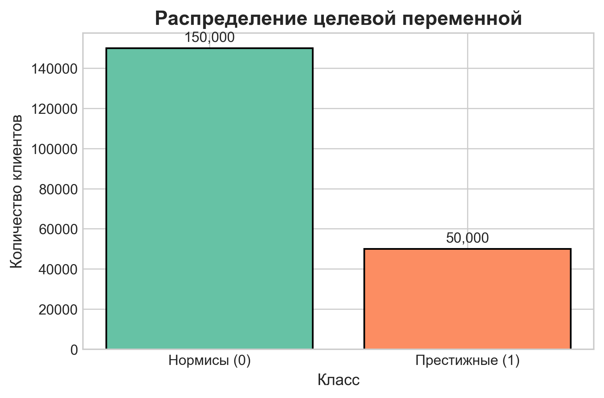
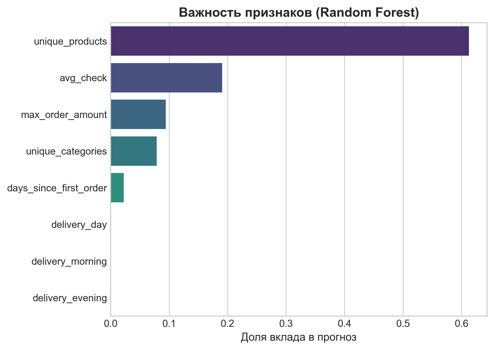
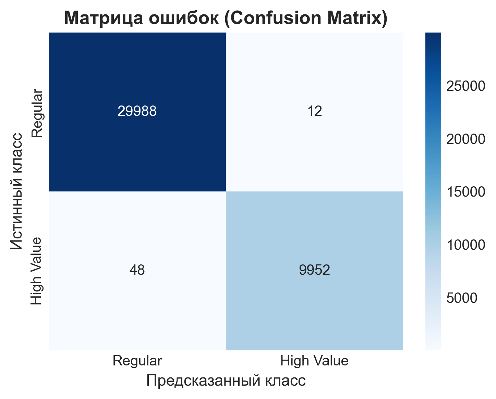
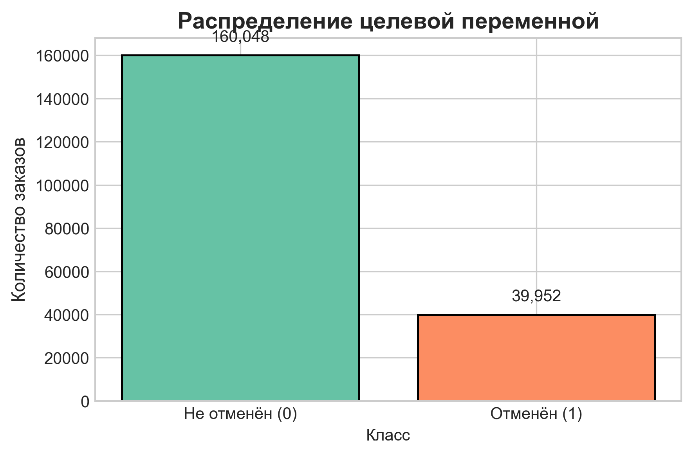
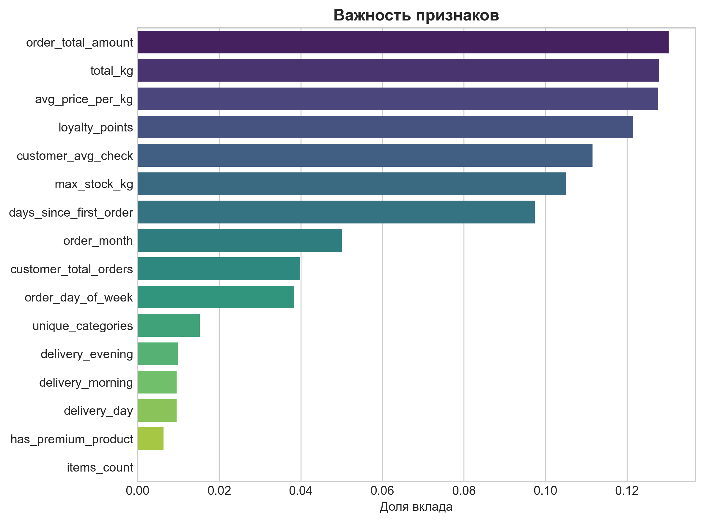
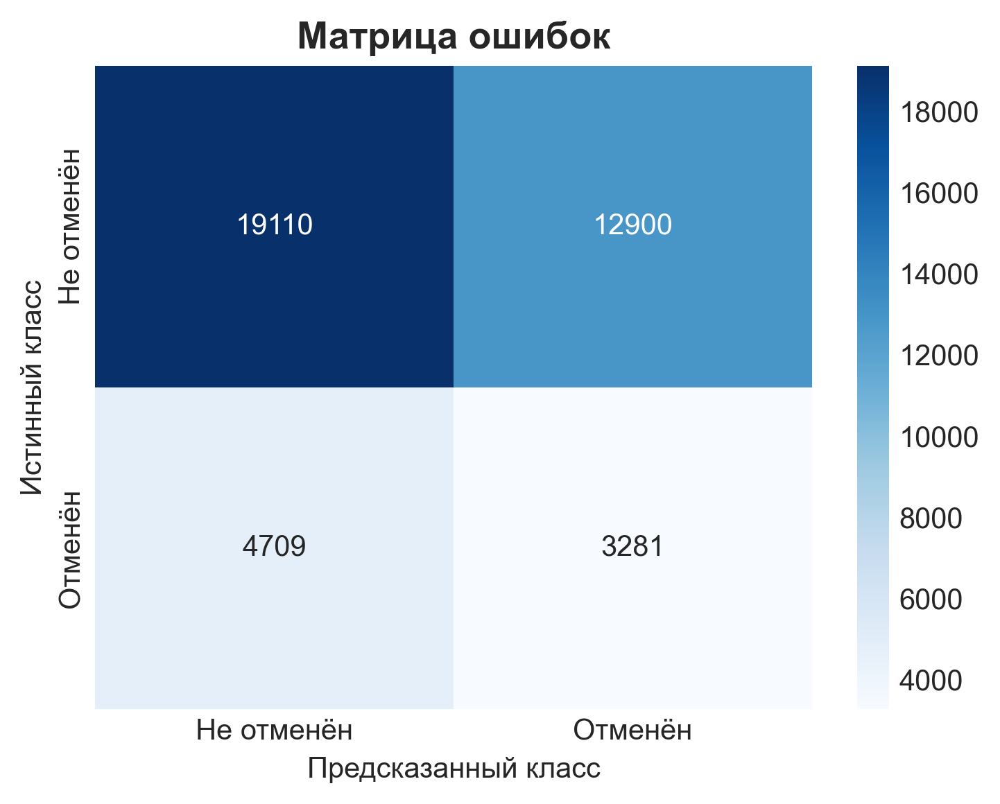

## Отчёт по лабораторной работе №2 по предмету «Корпоративные базы данных»

### Выполнил: Стукалкин Егор Олегович

#### Задача машинного обучения: Сегментация клиентов интернет-магазина
В данной работе разработана модель бинарной классификации для автоматического выявления клиентов категории «высокой ценности» (High Value), простым языком - значимых или престижных клиентов. Цель — обнаружение поведенческих паттернов, позволяющих прогнозировать принадлежность покупателя к топ-25% по объёму трат без использования прямых финансовых метрик в процессе инференса.
- **Целевая переменная (y):** is_high_value (1/0). Формируется по правилу: клиент получает метку 1 (престижный), если его суммарные траты (total_spent) превышают 75-й перцентиль по всей выборке, иначе 0 (нормис).
- **Вектор признаков (X):** 8 поведенческих характеристик, очищенных от утечки данных (total_spent и order_count исключены из матрицы признаков): 
    * средний чек (avg_check),
    * максимальная сумма заказа,
    * количество уникальных товаров
    * количество уникальных категорий,
    * давность первого заказа, 
    * а также бинарные признаки предпочтений по времени доставки (всего их 3 для утра, дня и вечера).
- **Классификатор:** RandomForestClassifier. Выбран за устойчивость к нелинейным зависимостям, встроенную оценку важности признаков и отсутствие необходимости масштабирования данных.
- **Оценка эффективности:** Accuracy, Precision, Recall, F1-score, ROC-AUC. Подбор гиперпараметров выполнен через GridSearchCV с кросс-валидацией.

<em>Основной код работы будет представлен в файле main.ipynb. Запросы к БД в файла quaries.sql</em>

Всего в выборке у нас 200000 экземпляров, как и число людей в БД. В тестовой выборке 20%, а неравномероность распределения видно на следующем графике:

Диаграмма подтверждает корректность разметки: классы разделены в пропорции 75%/25%, что соответствует заданному порогу 75-го перцентиля. Такой лёгкий дисбаланс является естественным для задачи сегментации "топ-клиентов" и будет учтён при оценке модели через метрики Precision/Recall и F1-score.

#### Анализ результатов
**Важность признаков:**

**Матрица ошибок:**

**Таблица метрик**
| Метрика | Класс 0 (Regular) | Класс 1 (High Value) | Общий показатель |
|---------|------------------|---------------------|-----------------|
| **Precision** | 1.00 | 1.00 | — |
| **Recall** | 1.00 | 1.00 | — |
| **F1-score** | 1.00 | 1.00 | **1.00** |
| **Support** | 30 000 | 10 000 | 40 000 |
| **Accuracy** | — | — | **1.00** |
| **ROC-AUC** | — | — | **0.9993** |

Модель показала Accuracy = 1.00 и F1-score = 1.00 на тестовой выборке. Столь высокие метрики свидетельствуют об утечке данных на этапе формирования признаков. Это произошло из-за того, что целевая переменная вычисляется по схожим формулам, что и для некоторых признаков, поэтому классификатор так хорошо отработал.

Для чистоты эксперимента была решена вторая ml-задача, но уже целевой переменной выступал признак, который сформировался случайно в ходе выполнения ЛР1. 

**Задача №2:** Бинарная классификация заказов на отменённые/неотменённые.
- Целевая переменная (y): is_cancelled = 1 если status = 'cancelled', иначе 0.
- Признаки (X) (16 шт.) группировались по следующим категориям:
    - *Клиент:* лояльность, давность, история заказов, средний чек
    - *Заказ:* сумма, кол-во позиций, вес, цена/кг, категории, премиум-флаг, склад, день/месяц
    - *Доставка:* предпочтения по времени (утро/день/вечер)
- Классификатор: RandomForestClassifier с class_weight='balanced' для учёта естественного дисбаланса классов.
- Метрика оптимизации: F1-score.

Всего в выборке у нас 1000000 экземпляров, как и число заказов в БД. Однако, для ускорения работы было взято 200000 экземпляров. В тестовой выборке 20%, а неравномероность распределения видно на следующем графике:

#### Анализ результатов
**Важность признаков:**

**Матрица ошибок:**

**Таблица метрик**
| Метрика | Класс 0 (Не отменён) | Класс 1 (Отменён) | Общий показатель |
|---------|---------------------|-----------------|-----------------|
| **Precision** | 0.80 | 0.20 | — |
| **Recall** | 0.61 | 0.40 | — |
| **F1-score** | 0.69 | 0.27 | **0.48 (macro avg)** |
| **Support** | 160 054 | 39 946 | 200 000 |
| **Accuracy** | — | — | **0.56** |
| **ROC-AUC** | — | — | **0.5014** |

**Интерпретация:** Модель показала результаты на уровне случайного угадывания. Это вполне ожидаемый результат, поскольку целевая переменная `status` генерировалась по равномерному закону и не имеет причинно-следственной связи с признаками. Random Forest отлично показал, что данные действительно случайные.

### Итоговый вывод по машинному обучению

Проведено два эксперимента на одной предметной области с разными типами целевых переменных:

1. **Задача сегментации клиентов** показала метрики близкие к идеальным (Accuracy=1.00, ROC-AUC=0.9993). Анализ важности признаков выявил доминирование `unique_products` (61%) и `avg_check` (19%), которые вычисляются сходим образом, как и `is_high_value`. Это классический пример утечки данных: модель не научилась предсказывать, а выучила математическую зависимость между признаками и целью.

2. **Задача предсказания отмены заказа** продемонстрировала результаты на уровне случайного угадывания (ROC-AUC=0.5014, F1=0.27). Это нормальный и ожидаемый результат, поскольку поле `status` генерировалось случайно и не коррелирует с поведенческими признаками клиентов.

**Таким образом**, для случайно сгенерированных данных обе задачи были решены успешно. Касательно первой задачи, безусловно можно придумать более сложное математичекое преобразование данных, чтобы Random Forest было сложнее увидеть закономерность. Однако это не являлось целью данной работы и задача ставилась больше с точки зрения бизнес-целей.
